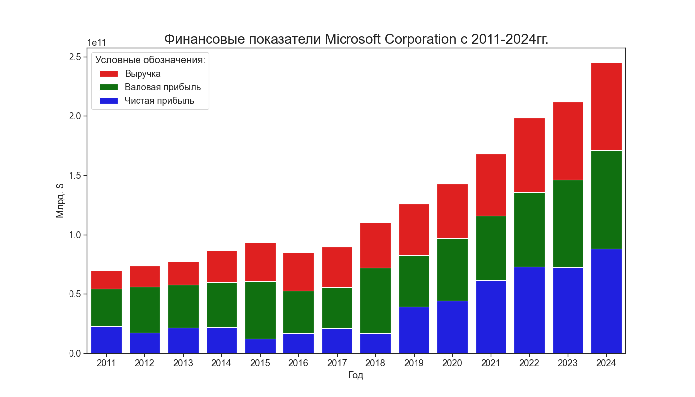
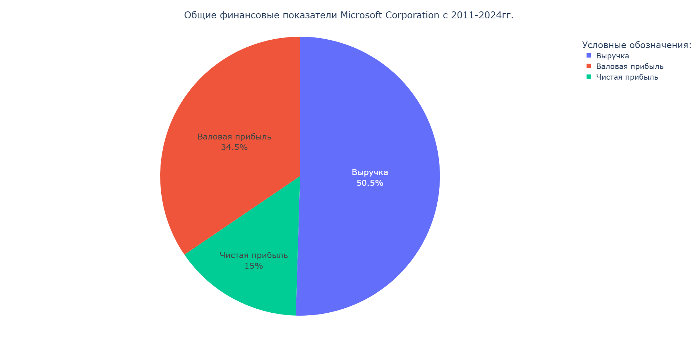

# Сравнение различных библиотек для визуализации данных: Matplotlib, Seaborn и Plotly
---
За основу массива данных будет взята финансовая отчетность Microsoft Corporation за последние 14 лет. В качестве методов визуализации будут использоваться самые распространенные: линейные модели, столбчатые и круговые диаграммы. Оценка будет производиться по
следующим критериям: интерактивность, интеграция в Web, типы диаграмм и простота использования. Программная реализация задачи разбита на три модуля:
* graf_PLT.py
* graf_SNS.py
* graf_PLT.py

Логика работы в файлах Python заключается в том, что сначала происходит чтение (загрузка) данных из файла формата csv с запятой в качестве разделителя. Далее на основе этих данных строятся три варианта графиков, которые в интерпретаторе выводятся либо в
дополнительном окне, либо в браузере в зависимости от используемой библиотеки. Файл MSFT.csv содержит в себе данные отдельных параметров финансовой отчетности Microsoft Corporation с 2011 по 2014 год и состоит из следующих полей:
* год (year)
* выручка (earnings)
* чистая прибыль (revenue)
* валовая прибыль (gross_profit)

Пример построения линейного графика с помощью библиотеки Matplotlib:

Пример построения стобчатой диаграммы с помощью библиотеки Seaborn:

Пример построения круговой диаграммы с помощью библиотеки Plotly:

Для создания визуализаций использовались следующие функции:

Общие:
* read_csv() - чтение данных
* head() - выбор данных
* savefig() - сохранение графика в файл
* show() - вызов графика для отображения

1. Библиотека Matplotlib:
* figure() - задание размера области построения графика
* title() - название графика
* xlabel() и plt.ylabel() Название осей х и y
* plot() - построение линии
* bar() - построение столбца
* pie() - построение круга
* legend() - создание легенды
* grid() - отображение сетки на графике

2. Библиотека Seaborn:
* set_style() - применение стиля графика
* lineplot() - построение линии
* barplot() - построение столбца
* set_title() - название графика
* color_palette() - использование цветовой палитры

3. Библиотека Plotly:
* go.Figure() - создание графика
* add_trace(go.Scatter()) - добавление на график линии
* go.Bar() - построение столбца
* px.pie() - построение круга
* update_layout() - название графика
* update_xaxes() и update_yaxes() - параметры осей x и y
* update_traces() - оформление всплывающей подсказки
* write_image() - сохранение графика в файл

Все 3 представленные в работе библиотеки предназначены для визуализации больших массивов данных, имеют готовые шаблоны визуализации и довольно широкий набор возможностей. Matplotlib и Seaborn выводят статичные графики без возможности интерактивного
взаимодействия с ними. Вывод графиков происходит в дополнительном окне, визуализации появляются последовательно друг за другом после закрытия предыдущей, так как код для данной работы был написан в одном модуле для каждой библиотеки.

Matplotlib имеет гибкие возможности для настройки отображения графиков, осей и подписей. В Seaborn нет возможности вывести дополнительно оси и настроить их, для этого в программный код интегрируют вызов библиотеки Matplotlib. К отличительным особенностям
Plotly можно отнести вывод результатов работы программы в отдельные страницы браузера с возможностью смотреть их в необходимом порядке, переключаться произвольно между вкладками и интерактивность самих графиков и диаграмм (при наведении курсора видны
всплывающие подсказки). Таким образом можно исследовать детальнее график, приближать, отдалять, выделять области, сохранять изображение.
